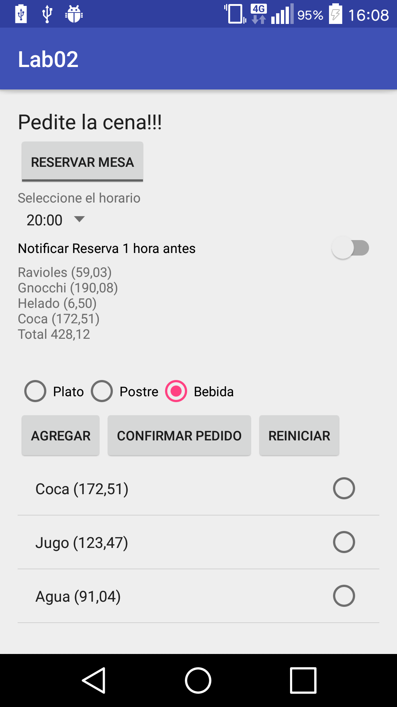

# Diseño de Aplicaciones Móviles - UTN FRSF - Laboratorio 2

Aplicación Android de un restaurante para que los comensales hagan sus pedidos, indicando si van a reservar mesa o pedir delivery, la hora del pedido, si desea que se le notifique 1 hora antes y sus opciones del menú.

#Credits
Daniel Campodonico  
Emiliano Gioria  
Lucas Moretti  

#License
    Copyright (c) 2016 Daniel Campodonico; Emiliano Gioria; Lucas Moretti.

    This program is free software: you can redistribute it and/or modify
    it under the terms of the GNU General Public License as published by
    the Free Software Foundation, either version 3 of the License, or
    (at your option) any later version.

    This program is distributed in the hope that it will be useful,
    but WITHOUT ANY WARRANTY; without even the implied warranty of
    MERCHANTABILITY or FITNESS FOR A PARTICULAR PURPOSE.  See the
    GNU General Public License for more details.

    You should have received a copy of the GNU General Public License
    along with this program.  If not, see <http://www.gnu.org/licenses/>.
